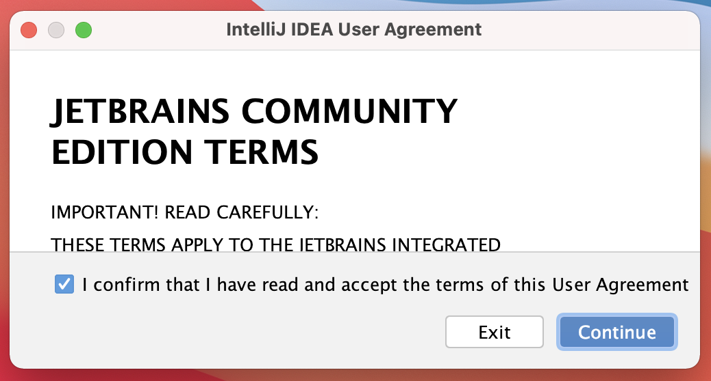
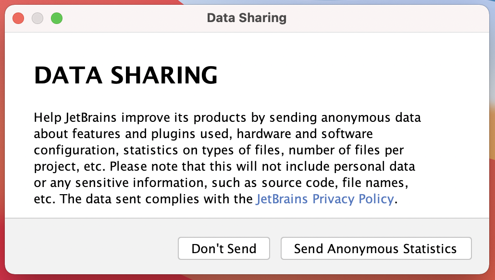
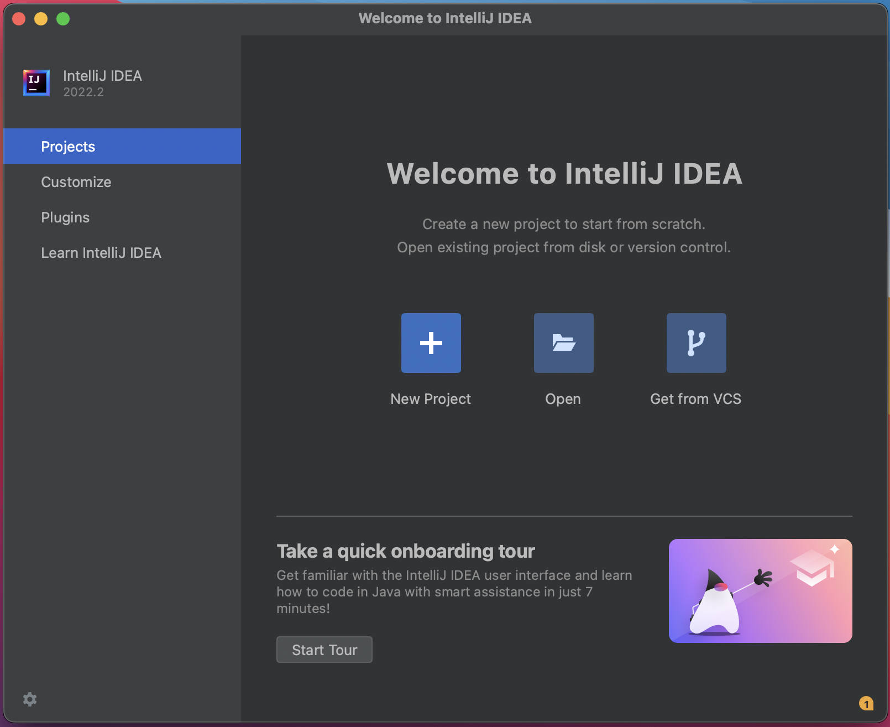
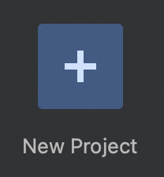
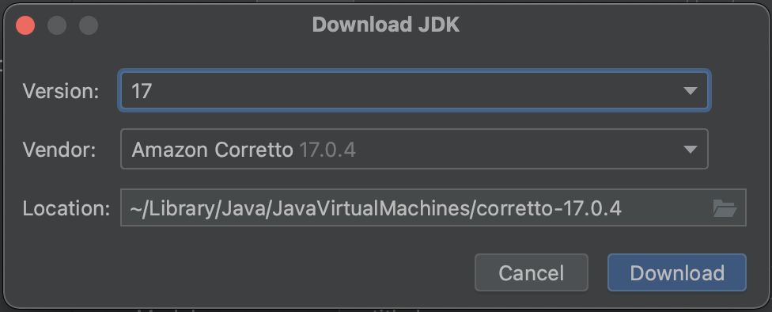
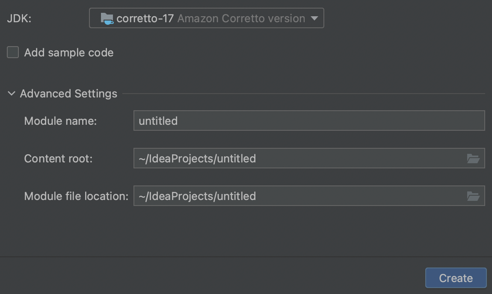
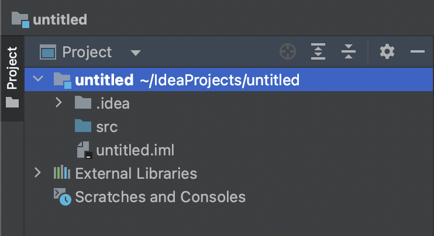
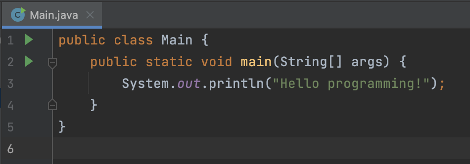
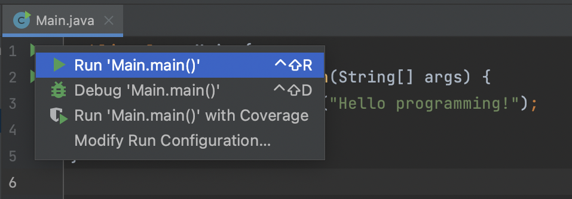

# Домашнее задание к занятию "Java"

Итак, для того чтобы начать программировать, вам нужна специальная программа. С этого мы и начнем! Ваша задача подготовиться к дальнейшим занятиям, скачать, установить и настроить IDE. Вперед!)

Для выполнения задания и дальнейшего прохождения курса требуется компьютер с операционной системой Windows, MacOS или Linux

------

### Инструкция по установке IntelliJ IDEA

Шаг 1. Перейдите по адресу [Intellij Idea, версия Community](https://www.jetbrains.com/ru-ru/idea/), нажмите кнопку "Скачать":

Шаг 2. Выберите необходимую ОС (Windows, macOS, Linux):

Шаг 3. В разделе Community нажмите кнопку "Скачать":

Шаг 4. Дождитесь загрузки файла и запустите его:

Шаг 5. и нажмите кнопку "Установить" Дождитесь завершения установки и нажмите кнопку "Готово" (флажок "Запустить JetBrains Toolbox" должен быть выставлен): Иконка Toolbox появится в системном трее, кликните на ней левой кнопкой мыши : Прочитайте лицензионное соглашение и нажмите кнопку "Accept":

Шаг 6. Нажмите "Install" для "IntelliJ IDEA Community":

Шаг 7. Дождитесь завершения установки и нажмите на кнопку запуска "IntelliJ IDEA Community":

Шаг 8. Если вы до этого не пользовались IntelliJ IDEA (и у вас нет сохранённых настроек) выберите опцию "Do not import settings", затем кнопку "OK":

Шаг 9. Согласитесь с "Privacy Policy" и нажмите кнопку "Continue":

Шаг 10. При желании вы можете отправлять данные об использовании IntelliJ IDEA в компанию IDEA (выберите любую из опций: "Send ..." - отправлять, "Don't send" - не отправлять):

Шаг 11. Выберите по своим предпочтениям тему оформления (тёмную "Darcula" или светлую "Light") и нажмите на кнопку "Skip Remaining and Set Defaults":

Шаг 12. Дождитесь появления стартового окна и выберите "Create New Project":

Шаг 13. Удостоверьтесь, что при выборе "Java" в списке есть "11 (java version "11.x.x")" или другая установленная на предыдущих лекциях версия джавы и нажмите на кнопку "Next":

Шаг 14. Нажмите "Next":

Шаг 15. Оставьте значение полей по умолчанию, предварительно убедившись, что в пути к проекту нет никаких кириллических символов или пробелов (если же они там есть - измените путь с помощью кнопки `...`, например, на `C:/Projects/untitled`) и нажмите "Finish":

Шаг 16. Чтобы не получать при каждом запуске подсказок по использованию IntelliJ IDEA, снимите флажок "Show tips on startup" и нажмите кнопку "Close": 

Шаг 17. При первом запуске IntelliJ IDEA понадобится какое-то время, чтобы проиндексировать вашу установку JDK, подождите, пока все процессы завершатся:

Шаг 18. В панельке проекта (`Alt + 1`) раскройте структуру каталогов и на каталоге `src` щёлкните правой кнопкой мыши и выберите "New" -> "Java Class":

Шаг 19: В открывшемся окне введите `Main` и нажмите клавишу "Enter":

Шаг 20: Замените содержимое открывшегося файла [кодом с лекции](https://github.com/netology-code/javaqa-code/blob/master/1.1_intro/hello-programming/src/Main.java), чтобы текущее состояние соответствовало тому, что вы видите на экране:

Шаг 21: Нажмите на зелёную стрелку на первой строке, выберите "Run 'Main.main()'":

Шаг 22: Удостоверьтесь, что вывод программы соответствует скриншоту:

Поздравляем! Вы успешно установили IntelliJ IDEA и запустили первое Java-приложение.

